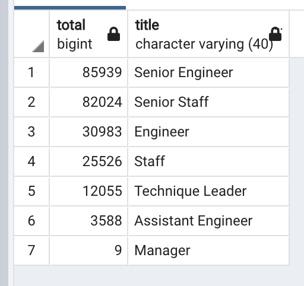
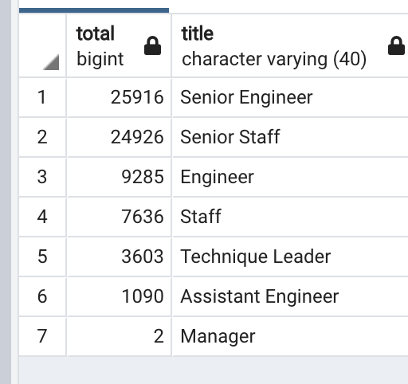

# Pewlett-Hackard-Analysis
Challenge 7

## Overview of the analysis:

The company where Bobby works has a huge number of retirement-ready employees. So Bobby's manager has given us two assignments: First we need to determine the number of retiring employees per title, and second we need to identify employees who are eligible to participate in a mentorship program. Then, we should write a report that summarizes your analysis and helps prepare Bobby’s manager for the “silver tsunami” as many current employees reach retirement age.

## Results:
Analising the results we can see that, for example, from 85,939 current Senior Engineer there are 25,916 ready to retire this year. This is a big chunck of the employees. From a total of 9 managers 2 are ready to retire. And so on.

As to minimize the impact of the losses of som many employees we identified 1549 employees to mentor younger employees.

